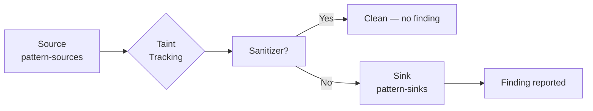

Semgrep's taint analysis tracks data as it flows through your program. You define **sources** (where untrusted data enters), **sinks** (where it must not arrive without sanitization), and optionally **sanitizers** (functions that make data safe) and **propagators** (functions that pass taint through).

When Semgrep finds a path from a source to a sink with no sanitizer in between, it reports a finding.

## How taint mode works

Enable taint mode by setting `mode: taint` in a rule. In taint mode:

1. Semgrep identifies all locations matched by `pattern-sources` and marks the resulting values as tainted.
2. Semgrep tracks tainted values as they are assigned, passed as arguments, and returned from functions.
3. When a tainted value reaches a location matched by `pattern-sinks`, Semgrep reports a finding.
4. If the tainted value passes through a `pattern-sanitizers` location, it is marked clean and is no longer reported at sinks.



## Basic taint rule

The following rule detects SQL injection in Python by tracking user input from a Django request to a raw database query:

```yaml
rules:
  - id: sql-injection
    mode: taint
    pattern-sources:
      - pattern: request.GET.get(...)
      - pattern: request.POST.get(...)
      - pattern: request.data
    pattern-sinks:
      - pattern: cursor.execute(...)
      - pattern: connection.execute(...)
    message: >
      Possible SQL injection: user-controlled data flows into cursor.execute.
      Use parameterized queries instead.
    severity: ERROR
    languages: [python]
    metadata:
      cwe: "CWE-89: SQL Injection"
      owasp: "A03:2021 - Injection"
```

## Taint rule fields

### pattern-sources

Defines where tainted data originates. Each entry is a pattern that matches a source of untrusted input:

```yaml
pattern-sources:
  - pattern: request.args.get(...)
  - pattern: request.form.get(...)
  - pattern: request.json
  - pattern: os.environ.get(...)
```

You can use the full `patterns:` / `pattern-either:` syntax inside each source entry:

```yaml
pattern-sources:
  - patterns:
      - pattern: $OBJ.get($KEY)
      - metavariable-regex:
          metavariable: $OBJ
          regex: ^request$
```

### pattern-sinks

Defines where tainted data must not arrive. Each entry is a pattern that matches a dangerous operation:

```yaml
pattern-sinks:
  - pattern: cursor.execute($QUERY, ...)
  - pattern: os.system($CMD)
  - pattern: subprocess.run($CMD, ...)
  - pattern: eval($CODE)
```

By default, a finding is reported when any tainted value reaches any argument position matched by a sink pattern. Use `focus-metavariable` to narrow the report to a specific argument:

```yaml
pattern-sinks:
  - patterns:
      - pattern: cursor.execute($QUERY, ...)
      - focus-metavariable: $QUERY
```

### pattern-sanitizers

Defines functions or operations that remove taint. When tainted data passes through a sanitizer, it is marked clean:

```yaml
pattern-sanitizers:
  - pattern: django.db.connection.escape_string(...)
  - pattern: html.escape(...)
  - pattern: bleach.clean(...)
```

Sanitizers are checked **before** sinks. If tainted data is sanitized before reaching a sink, no finding is reported.

<Tip>
List only sanitizers you trust completely. A sanitizer that is applied to only one field but not another will not prevent all taint paths.
</Tip>

### pattern-propagators

By default, Semgrep tracks taint through direct assignments and function returns. Use `pattern-propagators` to explicitly declare how taint moves through custom functions or data structures:

```yaml
pattern-propagators:
  - pattern: $TO.append($FROM)
    from: $FROM
    to: $TO
  - pattern: $STR.format(..., $INPUT, ...)
    from: $INPUT
    to: $STR
```

Each entry requires:
- A `pattern` that matches the propagation site
- A `from` metavariable identifying the tainted input
- A `to` metavariable identifying the output that becomes tainted

## JavaScript / Express.js example

Track request body input to a MongoDB `find` query (NoSQL injection):

```yaml
rules:
  - id: nosql-injection-express
    mode: taint
    pattern-sources:
      - pattern: req.body
      - pattern: req.query
      - pattern: req.params
    pattern-sanitizers:
      - pattern: sanitize($INPUT)
      - pattern: validator.escape($INPUT)
    pattern-sinks:
      - pattern: $COLLECTION.find($QUERY)
      - pattern: $COLLECTION.findOne($QUERY)
      - pattern: $COLLECTION.deleteMany($QUERY)
    message: >
      User-controlled data in $QUERY flows into a MongoDB query.
      Validate and sanitize request input before using it in a database query.
    severity: ERROR
    languages: [javascript, typescript]
    metadata:
      cwe: "CWE-943: Improper Neutralization of Special Elements in Data Query Logic"
      owasp: "A03:2021 - Injection"
```

## Taint-related options

The following options in the `options:` field affect taint analysis behavior. See the full list in [Rule syntax reference](/writing-rules/rule-syntax).

| Option | Default | Effect |
|---|---|---|
| `taint_assume_safe_functions` | `false` | Treat any function call not listed as a source or propagator as a sanitizer. Reduces false positives when your codebase wraps inputs in many helper functions. |
| `taint_assume_safe_indexes` | `false` | Treat array/dict indexing (`arr[key]`) as not propagating taint. Useful when indexing with a tainted key but the value is trusted. |
| `taint_assume_safe_comparisons` | `false` | Treat comparison operators (`==`, `<`, etc.) as not propagating taint. |
| `taint_assume_safe_booleans` | `false` | Treat boolean operations as not propagating taint. |
| `taint_assume_safe_numbers` | `false` | Treat numeric literals and arithmetic as not propagating taint. |
| `taint_unify_mvars` | `false` | Require that metavariables shared between a source and a sink pattern bind to the same code. |
| `symbolic_propagation` | `false` | Track taint through symbolic values (variables that hold other variables). Improves recall at the cost of more false positives. |

Example using `taint_assume_safe_functions` to reduce noise:

```yaml
rules:
  - id: xss-flask
    mode: taint
    options:
      taint_assume_safe_functions: true
    pattern-sources:
      - pattern: request.args.get(...)
      - pattern: request.form.get(...)
    pattern-sinks:
      - pattern: flask.render_template_string($TEMPLATE, ...)
      - pattern: Markup($HTML)
    pattern-sanitizers:
      - pattern: escape($INPUT)
      - pattern: markupsafe.escape($INPUT)
    message: "Possible XSS: user input flows into $TEMPLATE without escaping"
    severity: ERROR
    languages: [python]
    metadata:
      cwe: "CWE-79: Cross-site Scripting"
      owasp: "A03:2021 - Injection"
```

## Taint labels (advanced)

Taint labels let you track multiple independent taint conditions in a single rule. Assign a `label` to sources and require specific label combinations at sinks:

```yaml
rules:
  - id: dangerous-combination
    mode: taint
    pattern-sources:
      - pattern: get_user_role()
        label: USER_ROLE
      - pattern: request.args.get(...)
        label: USER_INPUT
    pattern-sinks:
      - pattern: admin_action($CMD)
        requires: USER_ROLE and USER_INPUT
    message: "Admin action triggered with both user role and user input"
    severity: WARNING
    languages: [python]
```

The `requires` field on a sink accepts a Boolean expression over label names using `and`, `or`, and `not`.

<Note>
For more options and advanced taint configuration, see the [Rule Reference — Taint analysis](/rules/taint-analysis) page.
</Note>
